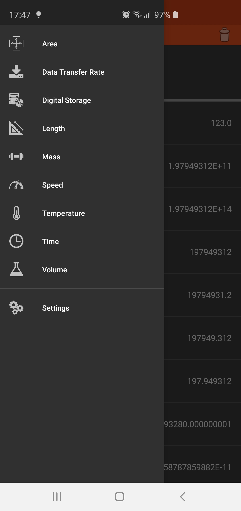
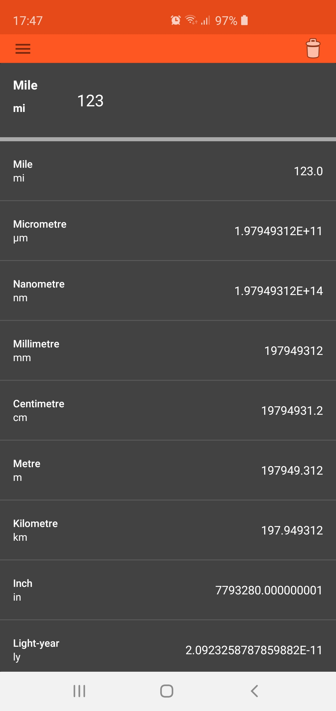

# Unit-Converter
This is my Unit Converter application for the module CSCU9YH.

# Features 

- **Area** (Square Metre, Square Kilometre, Square Yard, Square Foot, Square Inch, Square Mile)
- **Data Transfer Rate** (kbps, kB/s, Mbps, MB/s, Gbps, GB/s, Tbps, TB/s)
- **Digital Storage** (Bit, Byte, Kilobit, Kilobyte, Megabit, Megabyte, Gigabit, Gigabyte, Terabit, Terabyte, Petabit, Petabyte)
- **Length** (Millimetre, Centimetre, Metre, Kilometre, Inch, Light-year, Yard, Foot, Nautical mile, Mile, Micrometre, Nanometre)
- **Mass** (Kilogram, Stone, Pound, Ounce, Tonne, Gram)
- **Speed** (m/s, mph, km/h, Knot, Speed of Light, Speed of Sound)
- **Temperature** (Kelvin, Celsius, Fahrenheit)
- **Time** (Millisecond, Second, Minute, Hour, Day, Week, Month, Year, Decade, Century)
- **Volume** (Litre, Millilitre, Cubic Foot, Cubic Inch, Imperial Gallon, Imperial Quart, Imperial pint, Imperial Fluid Ounce, Imperial Tablespoon, Imperial Teaspoon)

## Settings
- **Theme** (Dark Mode, Normal Mode)

